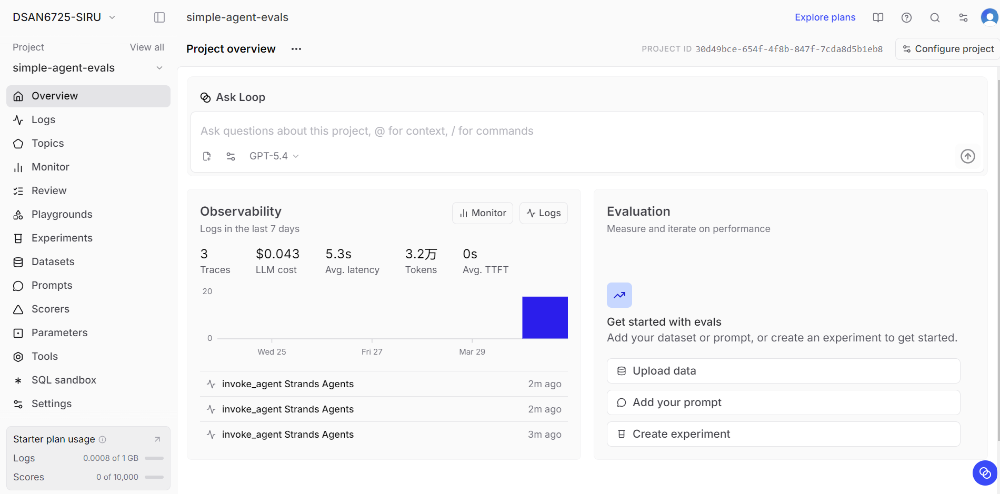
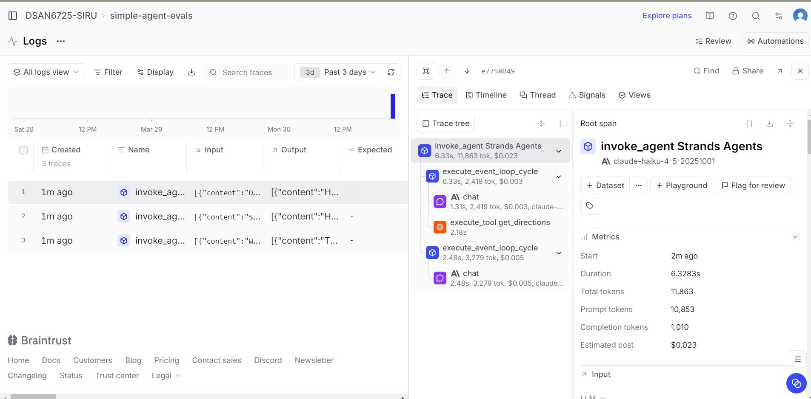
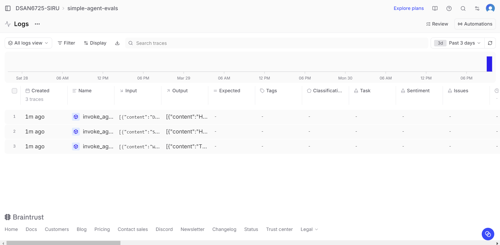

### Overview

In this lab, I ran the agent multiple times and used Braintrust to analyze its behavior. The logs show that the agent successfully handled multiple queries and generated traces for each interaction.

---

### Agent Behavior

From the trace details, the agent follows a structured process. It first processes the user input, then generates a response, and in some cases calls external tools.
# Lab 2: Simple Agent Observability

## Overview

In this lab, I ran the agent and used Braintrust to observe its behavior. The goal was to understand how the agent processes user queries, uses tools, and performs in terms of latency and token usage.

---

## Braintrust Observability

**Overview Metrics:**

**Trace Example:**

**Logs:**

---

## Analysis

From the traces, the agent follows a structured process. It processes the input, generates responses, and calls tools when necessary.

For example, in one trace, the agent used the `get_directions` tool correctly when handling a navigation-related query. This shows that the agent can select appropriate tools based on the task.

The metrics show that the average latency is around 5 seconds, and token usage is relatively high. This suggests that multi-step reasoning and tool usage increase both latency and cost.

Overall, the agent performs well, but there is room for improvement in efficiency and consistency of tool usage.
For example, in one trace, the agent correctly used the directions tool (`get_directions`) when the user asked for navigation-related information. This shows that the agent is capable of selecting appropriate tools based on the query.

---

### Tool Usage

Tool usage is visible in the trace tree. The agent called the directions tool and incorporated the result into the final response.

This indicates that the agent can:
- Identify when a tool is needed
- Execute the tool correctly
- Continue the reasoning process after tool execution

However, tool usage only appears in some traces, suggesting that the agent may not always rely on tools consistently.

---

### Metrics Analysis

From the Braintrust metrics:
- The average latency is around 5 seconds
- Total tokens used are relatively high (over 10k in one trace)
- The cost per trace is around $0.02

This shows that tool usage and multi-step reasoning increase both latency and token consumption. There is a tradeoff between response quality and efficiency.

---

### Key Observations

Overall, the agent performs well and is able to complete tasks with tool assistance. The main observations are:
- Tool selection works correctly in relevant scenarios
- Responses are accurate but sometimes costly in terms of tokens
- Latency increases when multiple steps or tools are involved

Future improvements could focus on reducing unnecessary token usage and improving efficiency.